# Data Flow Architecture

## Table of Contents
- [Overview](#overview)
- [Bill Upload & OCR Flow](#bill-upload--ocr-flow)
- [Analytics Dashboard Flow](#analytics-dashboard-flow)
- [Agentic RAG Chat Flow](#agentic-rag-chat-flow)
- [Retailer Recommendation Flow](#retailer-recommendation-flow)
- [Heatmap Analytics Flow](#heatmap-analytics-flow)
- [ROI Calculation Flow](#roi-calculation-flow)
- [Vector Search Flow](#vector-search-flow)
- [Memory & Persistence Flow](#memory--persistence-flow)
- [Error Handling](#error-handling)

---

## Overview

VoltPulse SG processes data through **8 primary flows**, each optimized for specific user journeys. Data moves from frontend → backend → AI services → database, with intelligent caching and state management.

### System-Wide Data Flow

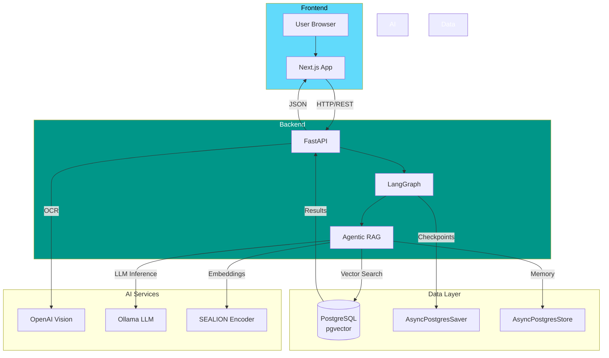

---

## Bill Upload & OCR Flow

### User Journey

1. User uploads SP Group utility bill (image/PDF)
2. Frontend sends to `/api/ocr/process`
3. Backend calls OpenAI Vision API (GPT-4o)
4. Structured data extracted and validated
5. Stored in PostgreSQL with `form_type=vision`
6. User redirected to Analytics Dashboard

### Detailed Sequence

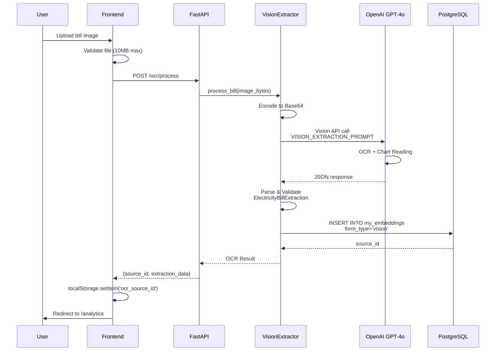

### Data Structures

**Request** (`POST /ocr/process`):
```typescript
{
  file: File  // multipart/form-data
}
```

**Response**:
```json
{
  "source_id": "uuid-v4-string",
  "form_data": {
    "form_type": "vision",
    "extraction_data": {
      "account_number": "1234567890",
      "consumption_kwh": 350.5,
      "total_amount": 95.50,
      "billing_period_start": "2024-10-01",
      "billing_period_end": "2024-10-31",
      "consumption_trends": [
        {
          "service_type": "Electricity",
          "monthly_data": [
            {"month": "JAN", "value": 320, "unit": "kWh"},
            {"month": "FEB", "value": 345, "unit": "kWh"}
          ],
          "national_average": 338,
          "neighbour_average": 300
        }
      ],
      "extraction_confidence": 0.92
    }
  },
  "created_at": "2024-11-15T10:30:00Z"
}
```

**Database Record**:
```sql
INSERT INTO my_embeddings (source_id, text_content, metadata, embedding)
VALUES (
    'uuid-here',
    '{"consumption_kwh": 350.5, "total_amount": 95.50, ...}'::jsonb,
    '{"form_type": "vision", "account_number": "****7890"}'::jsonb,
    NULL  -- No embedding for vision bills
);
```

**File**: `backend/app.py` (OCR endpoint), `backend/services/vision_extractor.py`

---

## Analytics Dashboard Flow

### User Journey

1. User navigates to `/analytics`
2. Frontend fetches OCR results from `source_id`
3. If diagnosis exists, display; else run diagnosis
4. Render consumption charts, stats, heatmap

### Detailed Sequence

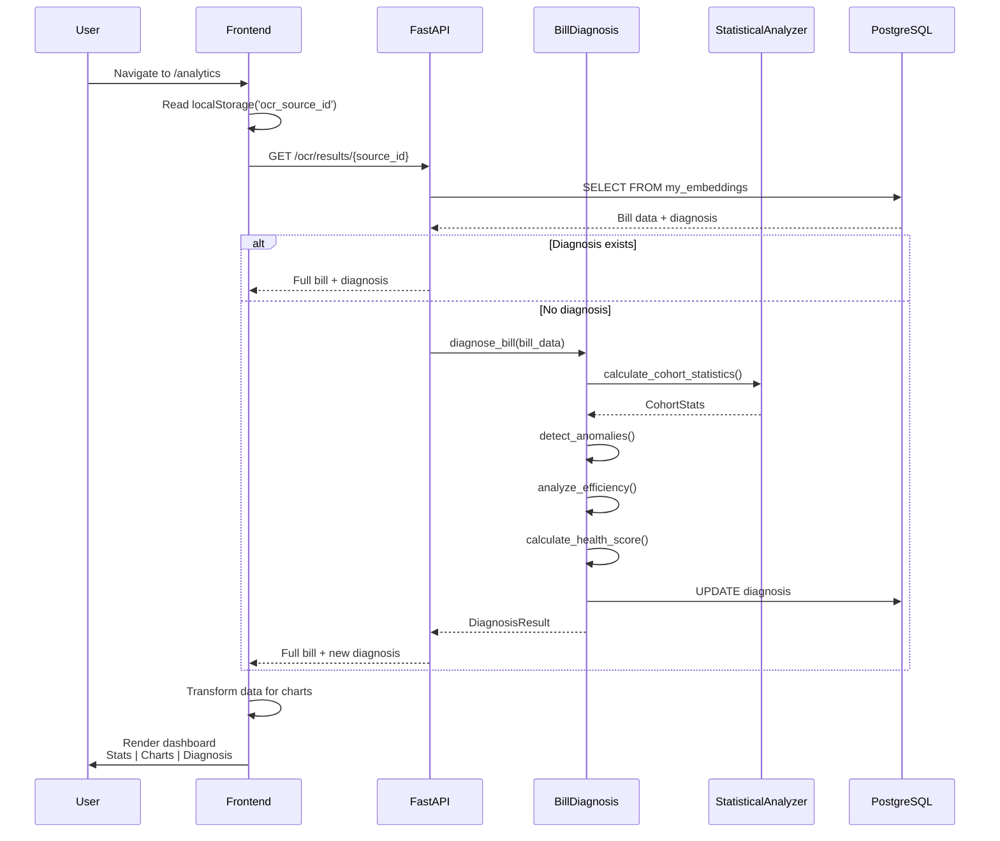

### Data Transformation

**Backend Response**:
```json
{
  "form_data": {
    "extraction_data": { ... },
    "diagnosis": {
      "overall_health_score": 75,
      "health_grade": "B",
      "anomalies": [
        {
          "severity": "MEDIUM",
          "message": "Consumption 25% above average",
          "z_score": 2.3,
          "p_value": 0.021
        }
      ],
      "efficiency_issues": [ ... ],
      "recommendations": [ ... ]
    }
  }
}
```

**Frontend Transformation**:
```typescript
// Transform for Recharts
const monthlyData = bill.consumption_trends[0].monthly_data.map(m => ({
  month: m.month,
  consumption: m.value,
  average: bill.consumption_trends[0].national_average
}));

// Calculate stats
const currentUsage = bill.consumption_kwh;
const nationalAverage = bill.consumption_trends[0].national_average;
const vsNational = ((currentUsage - nationalAverage) / nationalAverage) * 100;
```

**File**: `frontend/src/app/analytics/page.tsx:44-62,234-246`

---

## Agentic RAG Chat Flow

### User Journey

1. User types question in chat interface
2. Frontend streams to `/chat`
3. LangGraph routes through Classifier → Agentic RAG
4. Agent selects tools, executes, synthesizes response
5. Conversation stored in checkpoints + memory

### Detailed Sequence

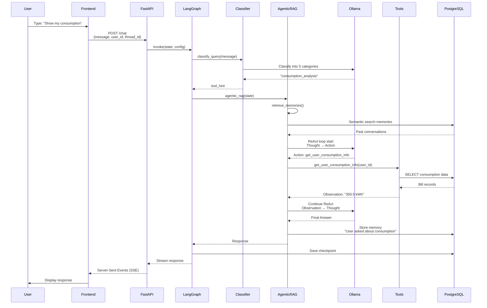

### Request/Response

**Request** (`POST /chat`):
```json
{
  "message": "What's my electricity consumption?",
  "user_id": "user-123",
  "thread_id": "thread-456"
}
```

**Response** (Server-Sent Events):
```
data: {"type": "start"}

data: {"type": "chunk", "content": "Your"}

data: {"type": "chunk", "content": " electricity"}

data: {"type": "chunk", "content": " consumption"}

data: {"type": "chunk", "content": " for October 2024 is **350.5 kWh**."}

data: {"type": "end"}
```

**Memory Storage**:
```python
await store.aput(
    namespace=("memories", user_id),
    key=f"memory-{timestamp}",
    value={
        "data": "User asked about consumption. Responded with 350.5 kWh for October 2024.",
        "timestamp": "2024-11-15T10:30:00Z"
    }
)
```

**File**: `backend/app.py:chat endpoint`, `backend/graph/builder.py`, `backend/agents/agentic_rag.py`

---

## Retailer Recommendation Flow

### User Journey

1. User asks "Find aircon retailers near Bedok"
2. Agent calls `find_retailers_by_product` tool
3. Product normalized, location extracted
4. Vector search on retailer embeddings
5. Product/location filtering
6. Top 10 results returned

### Detailed Sequence

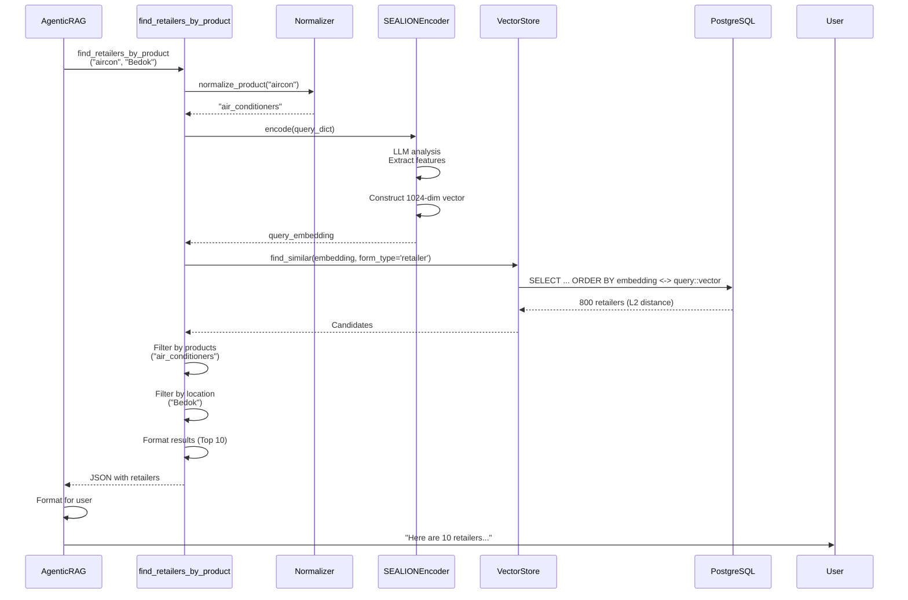

### Data Flow Details

**Tool Call**:
```python
@tool
def find_retailers_by_product(
    product: str,  # "aircon"
    location: str = ""  # "Bedok"
) -> str:
```

**Product Normalization**:
```python
# Input: "aircon", "air conditioner", "AC"
# Output: "air_conditioners"
normalized = PRODUCT_ALIASES.get(product.lower(), product)
```

**SEALION Encoding**:
```python
query_dict = {
    "causes": ["air_conditioners"],
    "country_codes": ["SG"],
    "languages": ["en"],
    "text": f"air conditioner retailer in Bedok Singapore"
}
embedding = await encoder.encode(query_dict)  # 1024-dim vector
```

**Vector Search**:
```sql
SELECT source_id, text_content, metadata, embedding <-> %s::vector AS distance
FROM my_embeddings
WHERE metadata->>'form_type' = 'retailer'
ORDER BY distance ASC
LIMIT 800;
```

**Filtering**:
```python
# Product filter
matches = [r for r in candidates if "air_conditioners" in r.products]

# Location filter (text-based, NOT RRF)
if "bedok" in location.lower():
    matches = [r for r in matches if "bedok" in r.address.lower()]
```

**Output** (to user):
```
Here are 10 authorized Climate Voucher retailers selling air conditioners near Bedok:

1. **Gain City** - 201 Victoria Street #01-23 Singapore 188067
   Products: Air-conditioners, Refrigerators, Washing Machines
   Distance: 0.12 (High relevance)

2. **Courts** - 321 Clementi Ave 3 #01-01 Singapore 129905
   ...
```

**File**: `backend/tools/retailer_tools.py:251-357`

---

## Heatmap Analytics Flow

### User Journey

1. User switches to Heatmap view
2. Frontend fetches GeoJSON from data.gov.sg
3. Backend aggregates district consumption
4. Map renders with color-coded districts
5. Click district for details

### Detailed Sequence

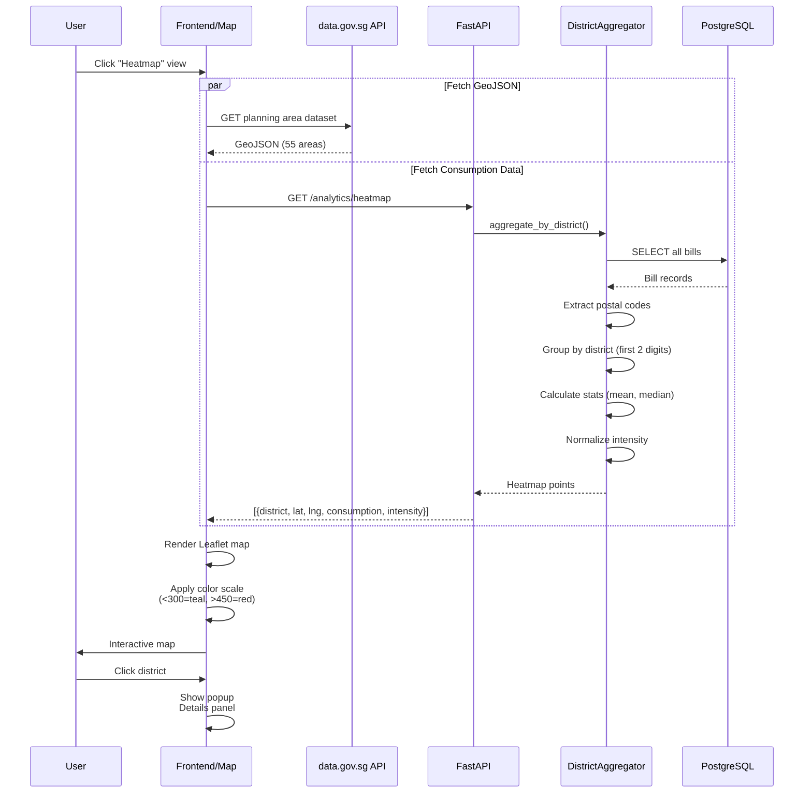

### Data Aggregation

**District Grouping**:
```python
# Input: Bills with addresses
bills = [
    {"premise_address": "BLK 123 BEDOK NORTH #05-67 S(460123)", "consumption_kwh": 350},
    {"premise_address": "456 ORCHARD ROAD #12-34 S(238888)", "consumption_kwh": 280},
    ...
]

# Extract postal codes
postal_codes = [
    extract_postal_code(bill["premise_address"]) for bill in bills
]  # ["460123", "238888", ...]

# Group by district (first 2 digits)
districts = defaultdict(list)
for bill, postal in zip(bills, postal_codes):
    if postal:
        district = postal[:2]  # "46", "23"
        districts[district].append(bill["consumption_kwh"])
```

**Statistics Calculation**:
```python
for district, consumptions in districts.items():
    result[district] = {
        "postal_district": district,
        "household_count": len(consumptions),
        "average_consumption_kwh": np.mean(consumptions),
        "median_consumption_kwh": np.median(consumptions),
        "min_consumption_kwh": np.min(consumptions),
        "max_consumption_kwh": np.max(consumptions)
    }
```

**Intensity Normalization**:
```python
max_consumption = max(d["average_consumption_kwh"] for d in districts.values())

for district in districts.values():
    district["intensity"] = district["average_consumption_kwh"] / max_consumption
    # intensity ∈ [0, 1]
```

**Color Mapping** (Frontend):
```typescript
function getConsumptionColor(consumption: number): string {
    if (consumption === 0) return "#d1d5db";  // gray
    if (consumption < 300) return "#14b8a6";  // teal
    if (consumption < 350) return "#22c55e";  // green
    if (consumption < 400) return "#eab308";  // yellow
    if (consumption < 450) return "#f97316";  // orange
    return "#ef4444";  // red
}
```

**File**: `backend/analytics/services/district.py:257-402`, `frontend/src/app/analytics/components/SingaporeHeatmap.tsx`

---

## ROI Calculation Flow

### User Journey

1. User selects appliance type (e.g., "Air-conditioner")
2. Inputs current rating (1-tick) and new rating (5-tick)
3. Inputs price ($1,500)
4. Backend calculates ROI with Climate Voucher
5. Returns payback period, savings, 10-year benefit

### Detailed Sequence

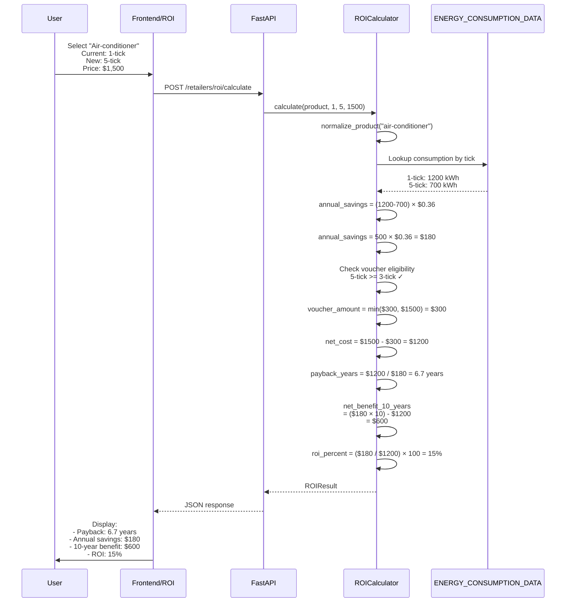

### Data Structures

**Request**:
```json
{
  "product_type": "air_conditioners",
  "current_rating": 1,
  "new_rating": 5,
  "product_price": 1500,
  "apply_voucher": true
}
```

**Energy Data Lookup**:
```python
ENERGY_CONSUMPTION_DATA = {
    "air_conditioners": {
        "consumption_by_tick": {
            1: 1200,  # kWh/year
            2: 1050,
            3: 920,
            4: 800,
            5: 700
        },
        "min_voucher_tick": 3,
        "typical_price_range": (599, 2500)
    }
}
```

**Response**:
```json
{
  "product_type": "air_conditioners",
  "product_display_name": "Air-conditioner",
  "current_rating": 1,
  "new_rating": 5,
  "tick_improvement": 4,
  "product_price": 1500.0,
  "voucher_amount": 300.0,
  "net_cost": 1200.0,
  "annual_energy_savings_kwh": 500.0,
  "annual_savings_sgd": 180.0,
  "monthly_savings_sgd": 15.0,
  "payback_period_months": 80,
  "payback_period_years": 6.7,
  "net_benefit_5_years": -300.0,
  "net_benefit_10_years": 600.0,
  "roi_percent_annual": 15.0,
  "is_voucher_eligible": true,
  "notes": [
    "This air-conditioner qualifies for the $300 Climate Voucher!",
    "Tip: Set temperature to 25°C for additional savings."
  ]
}
```

**File**: `backend/services/roi_calculator.py:155-255`

---

## Vector Search Flow

### Embedding Creation Flow

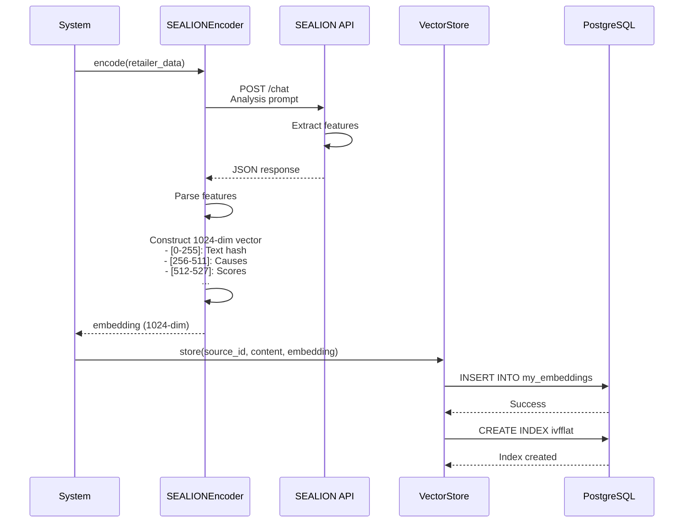

### Search Flow

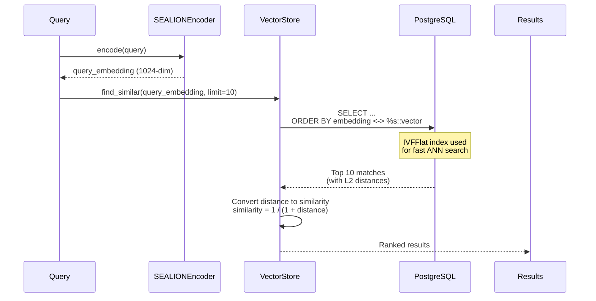

**SQL Query**:
```sql
SELECT
    source_id,
    text_content,
    metadata,
    embedding <-> %s::vector AS distance
FROM my_embeddings
WHERE metadata->>'form_type' = %s
ORDER BY distance ASC
LIMIT %s;
```

**File**: `backend/recommender/vector_store.py:200-271`

---

## Memory & Persistence Flow

### Checkpoint Flow (Conversation State)

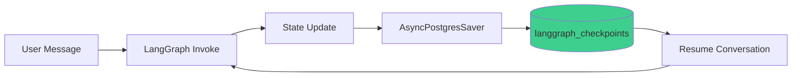

**Checkpoint Table**:
```sql
CREATE TABLE langgraph_checkpoints (
    thread_id TEXT,
    checkpoint_id TEXT,
    parent_checkpoint_id TEXT,
    checkpoint BYTEA,  -- Serialized state
    metadata JSONB,
    created_at TIMESTAMP DEFAULT NOW(),
    PRIMARY KEY (thread_id, checkpoint_id)
);
```

**Usage**:
```python
from langgraph.checkpoint.postgres.aio import AsyncPostgresSaver

checkpointer = AsyncPostgresSaver(pool)

# Save checkpoint
graph = graph.compile(checkpointer=checkpointer)

# Resume from checkpoint
config = {"configurable": {"thread_id": "thread-123"}}
result = await graph.ainvoke({"messages": [...]}, config)
```

### Memory Flow (Semantic Storage)

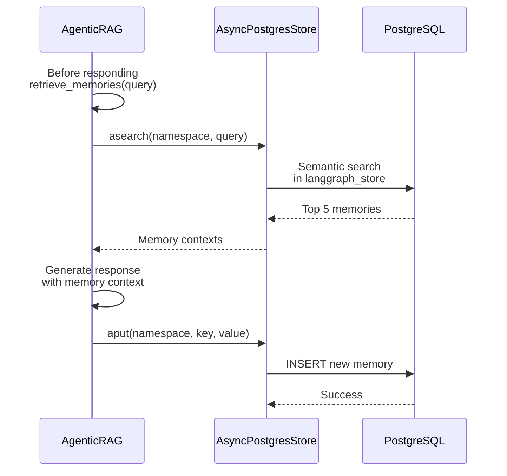

**Memory Storage**:
```python
await store.aput(
    namespace=("memories", user_id),
    key=f"memory-{uuid.uuid4()}",
    value={
        "data": "User asked about consumption. Current usage is 350.5 kWh.",
        "timestamp": datetime.now().isoformat()
    }
)
```

**Memory Retrieval**:
```python
memories = await store.asearch(
    namespace=("memories", user_id),
    query="consumption usage electricity",
    limit=5
)

context = "\n".join([m.value["data"] for m in memories])
```

**File**: `backend/agents/agentic_rag.py:140-180`

---

## Error Handling

### Error Flow

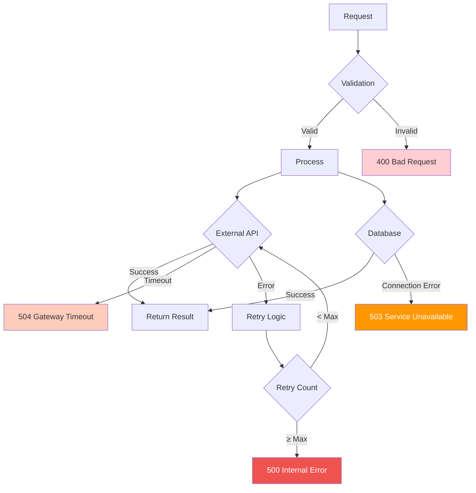

### Error Response Format

**Standard Error**:
```json
{
  "detail": "Error message",
  "status_code": 500,
  "timestamp": "2024-11-15T10:30:00Z"
}
```

**Validation Error** (Pydantic):
```json
{
  "detail": [
    {
      "loc": ["body", "consumption_kwh"],
      "msg": "field required",
      "type": "value_error.missing"
    }
  ]
}
```

**Retry Logic** (Vision OCR):
```python
async def extract_with_retry(
    image_bytes: bytes,
    max_retries: int = 2
) -> ElectricityBillExtraction:
    for attempt in range(max_retries + 1):
        try:
            result = await self.extract_from_bytes(image_bytes)
            if result.extraction_confidence > 0.3:
                return result
        except Exception as e:
            if attempt < max_retries:
                continue
            # Return error result on final attempt
            return ElectricityBillExtraction(
                extraction_confidence=0.0,
                extraction_warnings=[f"Failed after {max_retries+1} attempts: {str(e)}"]
            )
```

**File**: `backend/services/vision_extractor.py:274-310`

---

## Summary

VoltPulse SG's data flows are optimized for:

### ✅ Performance
- **Async I/O** - Non-blocking database/API calls
- **Connection Pooling** - Reuse database connections
- **Vector Indexing** - IVFFlat for fast ANN search
- **Caching** - 15-minute TTL for web search

### ✅ Reliability
- **Retry Logic** - OCR extraction, API calls
- **Checkpointing** - Resume interrupted conversations
- **Error Handling** - Graceful degradation
- **Validation** - Pydantic models at every boundary

### ✅ Scalability
- **Stateless APIs** - Horizontal scaling ready
- **Managed Services** - Supabase, Ollama cloud
- **Efficient Queries** - Index-optimized SQL
- **Streaming Responses** - SSE for chat

**Total Data Flows**: 8 primary flows covering all user journeys

**Related Documentation**:
- [System Overview](./overview.md) - High-level architecture
- [Tech Stack](./tech-stack.md) - Technology details
- [LangGraph Orchestration](../02-core-systems/langgraph-orchestration.md) - Graph execution
- [Vector Database](../02-core-systems/vector-database.md) - Storage layer
