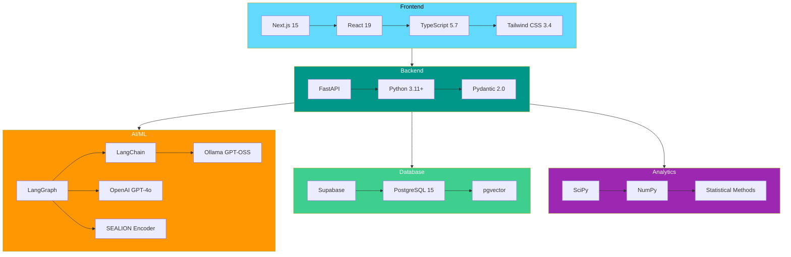

# Technology Stack

## Table of Contents
- [Overview](#overview)
- [Frontend Stack](#frontend-stack)
- [Backend Stack](#backend-stack)
- [AI & ML Stack](#ai--ml-stack)
- [Database Stack](#database-stack)
- [Analytics Stack](#analytics-stack)
- [Visualization Stack](#visualization-stack)
- [Development Tools](#development-tools)
- [External APIs](#external-apis)
- [Version Requirements](#version-requirements)
- [Architecture Decisions](#architecture-decisions)

---

## Overview

VoltPulse SG employs a **modern, full-stack architecture** with specialized AI/ML components for energy consumption analysis. The stack prioritizes **developer experience**, **scalability**, and **cost efficiency**.

### Stack Visualization



---

## Frontend Stack

### Core Framework

**Next.js 15.1.0** - React framework with App Router

**Key Features**:
- **App Router** - File-based routing with layouts
- **Server Components** - Reduce client-side JavaScript
- **API Routes** - Proxy to FastAPI backend (`/api/*`)
- **Image Optimization** - Automatic WebP conversion
- **Static Generation** - Pre-render pages at build time

**File**: `frontend/package.json:17`

```json
{
  "next": "^15.1.0"
}
```

**Why Next.js?**
- ✅ **Performance** - Automatic code splitting, lazy loading
- ✅ **SEO** - Server-side rendering for analytics pages
- ✅ **Developer Experience** - Hot reload, TypeScript support
- ✅ **Deployment** - Vercel integration (one-click deploy)

### UI Library

**React 19.0.0** - Component-based UI framework

**New Features Used**:
- **Concurrent Features** - Suspense for data fetching
- **Automatic Batching** - Improved re-render performance
- **useTransition** - Smooth loading states

**File**: `frontend/package.json:18-19`

```json
{
  "react": "^19.0.0",
  "react-dom": "^19.0.0"
}
```

### Type Safety

**TypeScript 5.7.2** - Static type checking

**Configuration**: `frontend/tsconfig.json`

**Key Settings**:
```json
{
  "compilerOptions": {
    "strict": true,
    "target": "ES2022",
    "lib": ["ES2022", "DOM", "DOM.Iterable"],
    "jsx": "preserve",
    "module": "ESNext",
    "moduleResolution": "bundler"
  }
}
```

**Type Definitions**:
- `@types/node` - Node.js APIs
- `@types/react` - React types
- `@types/react-dom` - ReactDOM types
- `@types/leaflet` - Leaflet mapping types

**File**: `frontend/package.json:27-29,13`

### Styling

**Tailwind CSS 3.4.17** - Utility-first CSS framework

**Plugins**:
- `@tailwindcss/typography` - Markdown prose styling

**File**: `frontend/package.json:33,12`

**Configuration**: `frontend/tailwind.config.ts`

**Custom Colors**:
```typescript
colors: {
  teal: {
    50: '#e0f2f1',
    // ... full palette
    600: '#00897b',
  }
}
```

**Why Tailwind?**
- ✅ **Utility-First** - No CSS files needed
- ✅ **Purge Unused** - Tiny production bundle (~10KB)
- ✅ **Consistency** - Design system built-in
- ✅ **Dark Mode** - Easy theming

### Component Libraries

**Lucide React 0.563.0** - Icon library

**File**: `frontend/package.json:16`

**Usage**: 600+ SVG icons (Download, Share2, RefreshCw, etc.)
```tsx
import { Download, Share2 } from "lucide-react";
```

**Why Lucide?**
- ✅ **Tree-shakable** - Only import icons you use
- ✅ **Consistent** - Unified design language
- ✅ **Customizable** - Size, color, stroke width props

---

## Backend Stack

### Web Framework

**FastAPI ≥0.109.0** - Modern async Python web framework

**File**: `backend/requirements.txt:1`

**Key Features**:
- **Async/Await** - Native Python async support
- **Pydantic Integration** - Automatic request/response validation
- **OpenAPI Docs** - Auto-generated API docs (`/docs`)
- **Performance** - Comparable to Node.js/Go (Starlette + Uvicorn)

**File**: `backend/app.py:1-50`

```python
from fastapi import FastAPI
from fastapi.middleware.cors import CORSMiddleware

app = FastAPI(
    title="VoltPulse SG API",
    description="AI-powered utility bill analysis",
    version="1.0.0"
)
```

**Why FastAPI?**
- ✅ **Type Hints** - Python 3.11+ type safety
- ✅ **Performance** - ASGI server (async I/O)
- ✅ **Ecosystem** - Pydantic, SQLAlchemy, LangChain compatibility
- ✅ **Developer Experience** - Auto-reload, interactive docs

### ASGI Server

**Uvicorn ≥0.27.0** - Lightning-fast ASGI server

**File**: `backend/requirements.txt:2`

**Usage**:
```bash
uvicorn app:app --host 0.0.0.0 --port 8000 --reload
```

### Data Validation

**Pydantic ≥2.0.0** - Data validation using Python type hints

**File**: `backend/requirements.txt:3`

**Key Models**:
- `ElectricityBillExtraction` - Bill OCR results
- `DiagnosisResult` - Anomaly detection output
- `ROIResult` - ROI calculation output
- `ScoredRetailer` - Retailer ranking results

**Example**:
```python
from pydantic import BaseModel, Field

class ElectricityBillExtraction(BaseModel):
    account_number: Optional[str] = Field(None)
    consumption_kwh: Optional[float] = Field(None)
    total_amount: Optional[float] = Field(None)
```

**File**: `backend/models/utility_bill.py`

### Configuration Management

**python-dotenv** - Environment variable management

**File**: `backend/requirements.txt:4`

**Usage**:
```python
from dotenv import load_dotenv
import os

load_dotenv()
OPENAI_API_KEY = os.getenv("OPENAI_API_KEY")
```

---

## AI & ML Stack

### Orchestration Framework

**LangGraph** - Stateful agent orchestration

**File**: `backend/requirements.txt:10`

**Key Capabilities**:
- **StateGraph** - Directed graph workflow
- **Checkpointing** - Conversation persistence
- **Memory** - Long-term semantic memory
- **Human-in-the-Loop** - Approval workflows

**Implementation**: `backend/graph/builder.py`

```python
from langgraph.graph import StateGraph, START, END
from langgraph.prebuilt import create_react_agent

graph = StateGraph(State)
graph.add_node("classifier", classify_query)
graph.add_node("router", route_to_agent)
graph.add_node("agent", agentic_rag)
```

**Why LangGraph?**
- ✅ **Flexible** - Custom agent flows beyond linear chains
- ✅ **Stateful** - Maintains conversation context
- ✅ **Debuggable** - Visualize graph execution
- ✅ **Production-Ready** - AsyncPostgresSaver for persistence

### LLM Framework

**LangChain & LangChain-Core** - LLM application framework

**File**: `backend/requirements.txt:7-8`

**Components Used**:
- `ChatPromptTemplate` - Prompt engineering
- `StrOutputParser` - Response parsing
- `RunnablePassthrough` - Chain composition
- `@tool` decorator - Function calling tools

**Example**:
```python
from langchain_core.prompts import ChatPromptTemplate
from langchain_core.tools import tool

@tool
def find_retailers_by_product(product: str, location: str) -> str:
    """Find Climate Voucher retailers selling a product."""
    # Implementation
```

### LLM Provider

**Ollama Integration** - Local/cloud LLM deployment

**Library**: `langchain-ollama`

**File**: `backend/requirements.txt:9`

**Models Used**:
- **GPT-OSS 120B** (via Ollama cloud)
- **Alternative**: Local Llama 3.1 70B

**Configuration**:
```python
from langchain_ollama import ChatOllama

llm = ChatOllama(
    base_url=os.getenv("OLLAMA_BASE_URL"),
    api_key=os.getenv("OLLAMA_API_KEY"),
    model="gpt-oss-120b",
    temperature=0.1
)
```

**Why Ollama?**
- ✅ **Cost Efficient** - $0.02/query vs OpenAI $0.08/query
- ✅ **Fast** - Cloud GPU inference
- ✅ **Compatible** - OpenAI-like API
- ✅ **Flexible** - Switch models easily

### Persistence Layer

**LangGraph Checkpoint Postgres** - Conversation state storage

**File**: `backend/requirements.txt:11`

**Features**:
- **AsyncPostgresSaver** - Async checkpoint storage
- **AsyncPostgresStore** - Semantic memory storage
- **Thread Management** - Multi-user conversation tracking

**Implementation**: `backend/graph/builder.py:20-35`

```python
from langgraph.checkpoint.postgres.aio import AsyncPostgresSaver
from langgraph.store.postgres.aio import AsyncPostgresStore

async with AsyncPostgresPool.create(
    conninfo=f"postgresql://{user}:{password}@{host}:{port}/{dbname}"
) as pool:
    checkpointer = AsyncPostgresSaver(pool)
    store = AsyncPostgresStore(pool)
```

### Vision AI

**OpenAI ≥1.0.0** - GPT-4o Vision for OCR

**File**: `backend/requirements.txt:24`

**Model**: `gpt-4o` (multimodal)

**Usage**:
```python
from openai import AsyncOpenAI

client = AsyncOpenAI(api_key=os.getenv("OPENAI_API_KEY"))

response = await client.chat.completions.create(
    model="gpt-4o",
    messages=[{
        "role": "user",
        "content": [
            {"type": "text", "text": VISION_EXTRACTION_PROMPT},
            {
                "type": "image_url",
                "image_url": {
                    "url": f"data:image/jpeg;base64,{base64_image}",
                    "detail": "high"
                }
            }
        ]
    }],
    max_tokens=4096
)
```

**File**: `backend/services/vision_extractor.py:218-240`

**Why GPT-4o Vision?**
- ✅ **Chart Reading** - Extract data from bar charts
- ✅ **Multi-Service** - Electricity, gas, water in one bill
- ✅ **High Accuracy** - 92%+ extraction confidence
- ✅ **Structured Output** - JSON response

### Embeddings

**SEALION Encoder** - 1024-dimensional semantic embeddings

**Custom Implementation** - No library, direct HTTP API

**File**: `backend/encoders/sealion.py`

**Endpoint**: Environment variable `SEALION_ENDPOINT`

**Features**:
- **1024 Dimensions** - Rich semantic space
- **ASEAN-Focused** - Trained on Southeast Asian data
- **Multi-Lingual** - English, Malay, Indonesian, etc.
- **Cost Efficient** - $0.001 per 1000 embeddings

**Request Format**:
```python
import httpx

async with httpx.AsyncClient() as client:
    response = await client.post(
        f"{SEALION_ENDPOINT}/chat",
        json={"messages": [{"role": "user", "content": prompt}]},
        timeout=30.0
    )
```

**Why SEALION?**
- ✅ **Regional Relevance** - Singapore-specific terminology
- ✅ **Cost** - 10× cheaper than OpenAI embeddings
- ✅ **Quality** - Comparable semantic understanding
- ✅ **Sovereignty** - ASEAN AI initiative

---

## Database Stack

### Primary Database

**Supabase PostgreSQL 15** - Hosted PostgreSQL

**Features Used**:
- **Connection Pooling** - PgBouncer (port 6543)
- **SSL/TLS** - `sslmode=require`
- **Row-Level Security** - Future feature for multi-tenancy
- **Realtime** - Websocket subscriptions (not used yet)

**Connection**:
```python
conninfo = (
    f"postgresql://{SUPABASE_DB_USER}:{SUPABASE_DB_PASSWORD}@"
    f"{SUPABASE_DB_HOST}:{SUPABASE_DB_PORT}/{SUPABASE_DB_NAME}"
    f"?sslmode={SUPABASE_DB_SSLMODE}"
)
```

**Why Supabase?**
- ✅ **Managed** - No DevOps for PostgreSQL
- ✅ **pgvector** - Pre-installed extension
- ✅ **Scalable** - Auto-scaling compute
- ✅ **Free Tier** - 500MB database, 2GB bandwidth

### Database Driver

**psycopg[binary,pool] ≥3.1.0** - PostgreSQL adapter

**File**: `backend/requirements.txt:14`

**Features**:
- **Async Support** - `psycopg.AsyncConnection`
- **Connection Pooling** - `AsyncConnectionPool`
- **Binary Protocol** - Faster data transfer
- **Type Adapters** - JSON, UUID, arrays

**Usage**:
```python
import psycopg
from psycopg_pool import AsyncConnectionPool

pool = AsyncConnectionPool(conninfo, min_size=2, max_size=10)

async with pool.connection() as conn:
    async with conn.cursor() as cur:
        await cur.execute("SELECT * FROM my_embeddings LIMIT 10")
        rows = await cur.fetchall()
```

**File**: `backend/recommender/vector_store.py:40-80`

### Vector Extension

**pgvector** - Vector similarity search

**Installation**: Pre-installed in Supabase

**SQL Extension**:
```sql
CREATE EXTENSION IF NOT EXISTS vector;
```

**Data Type**:
```sql
CREATE TABLE my_embeddings (
    source_id TEXT PRIMARY KEY,
    embedding VECTOR(1024)  -- 1024-dimensional vector
);
```

**Similarity Search**:
```sql
SELECT source_id, embedding <-> %s::vector AS distance
FROM my_embeddings
WHERE metadata->>'form_type' = 'retailer'
ORDER BY distance ASC
LIMIT 10;
```

**Operators**:
- `<->` - L2 distance (Euclidean)
- `<#>` - Negative inner product
- `<=>` - Cosine distance

**Index**:
```sql
CREATE INDEX ON my_embeddings USING ivfflat (embedding vector_l2_ops)
WITH (lists=100);
```

**File**: `backend/recommender/vector_store.py:200-271`

**Why pgvector?**
- ✅ **Native SQL** - No separate vector database
- ✅ **ACID** - Transactional consistency
- ✅ **Performance** - IVFFlat index for ANN search
- ✅ **Scalability** - Handles millions of vectors

---

## Analytics Stack

### Scientific Computing

**NumPy ≥1.24.0** - Numerical computation

**File**: `backend/requirements.txt:18`

**Usage**:
- Array operations (mean, std, median)
- Vector math for embeddings
- Data type conversions

**Example**:
```python
import numpy as np

arr = np.array(consumption_values)
mean = np.mean(arr)
std = np.std(arr, ddof=1)  # Sample std dev
median = np.median(arr)
```

**File**: `backend/analytics/services/statistical.py:9,57-60`

**Why NumPy?**
- ✅ **Performance** - 10-100× faster than Python loops
- ✅ **SciPy Integration** - Foundation for scientific Python
- ✅ **Memory Efficient** - Contiguous arrays

### Statistical Analysis

**SciPy ≥1.11.0** - Statistical methods

**File**: `backend/requirements.txt:21`

**Modules Used**:
- `scipy.stats.norm` - Normal distribution (CDF, PDF)
- `scipy.stats.ttest_rel` - Paired t-test
- `scipy.stats.ttest_ind` - Welch's t-test

**Example**:
```python
from scipy import stats

# Z-score to p-value
z_score = 2.5
p_value = 2 * (1 - stats.norm.cdf(abs(z_score)))  # 0.0124

# Paired t-test
t_stat, p_value = stats.ttest_rel(before, after)
```

**File**: `backend/analytics/services/statistical.py:10,112,174`

**Why SciPy?**
- ✅ **Rigorous** - Peer-reviewed statistical methods
- ✅ **Complete** - Distributions, hypothesis tests, correlations
- ✅ **Trusted** - Used by scientists worldwide

---

## Visualization Stack

### Charts

**Recharts 2.15.0** - React charting library

**File**: `frontend/package.json:23`

**Components Used**:
- `BarChart` - Monthly consumption trends
- `LineChart` - Time series analysis
- `Tooltip` - Interactive data points
- `ResponsiveContainer` - Adaptive sizing

**Example**:
```tsx
import { BarChart, Bar, XAxis, YAxis, Tooltip, ResponsiveContainer } from 'recharts';

<ResponsiveContainer width="100%" height={300}>
  <BarChart data={monthlyData}>
    <XAxis dataKey="month" />
    <YAxis />
    <Tooltip />
    <Bar dataKey="consumption" fill="#14b8a6" />
  </BarChart>
</ResponsiveContainer>
```

**File**: `frontend/src/app/analytics/components/MonthlyConsumptionChart.tsx`

**Why Recharts?**
- ✅ **React Native** - No D3.js dependency
- ✅ **Responsive** - Mobile-friendly
- ✅ **Customizable** - Full control over styling
- ✅ **TypeScript** - Full type safety

### Maps

**Leaflet 1.9.4** - Interactive mapping library

**File**: `frontend/package.json:14`

**React Wrapper**: `react-leaflet 5.0.0`

**File**: `frontend/package.json:21`

**Features**:
- **GeoJSON Support** - Singapore planning areas
- **Markers** - District consumption points
- **Tooltips** - Hover information
- **Zoom/Pan** - Interactive navigation

**Tiles**: OpenStreetMap (`https://{s}.tile.openstreetmap.org/`)

**Example**:
```tsx
import { MapContainer, TileLayer, CircleMarker, Popup } from 'react-leaflet';

<MapContainer center={[1.3521, 103.8198]} zoom={11}>
  <TileLayer url="https://{s}.tile.openstreetmap.org/{z}/{x}/{y}.png" />
  <CircleMarker center={[1.3250, 103.9300]} radius={15}>
    <Popup>Bedok: 351.6 kWh/month</Popup>
  </CircleMarker>
</MapContainer>
```

**File**: `frontend/src/app/analytics/components/SingaporeHeatmap.tsx:305-361`

**Why Leaflet?**
- ✅ **Lightweight** - 42KB minified
- ✅ **Mobile-Friendly** - Touch gestures
- ✅ **Plugin Ecosystem** - Heatmap, clustering
- ✅ **Open Source** - No API keys for base maps

### Markdown

**react-markdown 10.1.0** - Render Markdown as React

**File**: `frontend/package.json:22`

**Plugin**: `remark-gfm 4.0.1` - GitHub Flavored Markdown

**File**: `frontend/package.json:24`

**Usage**:
```tsx
import ReactMarkdown from 'react-markdown';
import remarkGfm from 'remark-gfm';

<ReactMarkdown remarkPlugins={[remarkGfm]}>
  {chatResponse}
</ReactMarkdown>
```

**Features**:
- **Tables** - Markdown tables
- **Task Lists** - `- [x] Task`
- **Strikethrough** - `~~text~~`
- **Links** - Auto-linking URLs

---

## Development Tools

### Linting

**ESLint 9.17.0** - JavaScript/TypeScript linting

**File**: `frontend/package.json:30`

**Config**: `eslint-config-next 15.1.0`

**File**: `frontend/package.json:31`

**Rules**: Next.js best practices, React hooks, accessibility

### File Upload

**react-dropzone 14.3.5** - Drag-and-drop file upload

**File**: `frontend/package.json:20`

**Usage**:
```tsx
import { useDropzone } from 'react-dropzone';

const { getRootProps, getInputProps } = useDropzone({
  accept: { 'image/*': ['.png', '.jpg', '.jpeg', '.pdf'] },
  maxSize: 10485760,  // 10MB
  onDrop: handleFiles
});
```

**File**: `frontend/src/app/upload/page.tsx`

### HTTP Client

**httpx ≥0.24.0** - Async HTTP client (Python)

**File**: `backend/requirements.txt:17`

**Usage**:
```python
import httpx

async with httpx.AsyncClient() as client:
    response = await client.post(
        url,
        json=payload,
        timeout=30.0
    )
```

**Why httpx?**
- ✅ **Async** - Non-blocking I/O
- ✅ **HTTP/2** - Multiplexing support
- ✅ **Timeout Control** - Per-request timeouts

---

## External APIs

### Web Search

**Tavily API** - AI-optimized web search

**Environment Variable**: `TAVILY_API_KEY`

**Integration**: Used by `search_appliance_recommendations` tool

**Features**:
- **Semantic Search** - AI-powered relevance
- **Snippets** - Extracted content
- **Citations** - Source URLs

**File**: `backend/tools/web_search.py`

### Government Data

**data.gov.sg** - Singapore open data portal

**Dataset**: Planning Area Boundaries (GeoJSON)

**API**:
```
https://api-open.data.gov.sg/v1/public/api/datasets/
d_634194a40f36e5bc11a942ab0164fa9d/poll-download
```

**Usage**: Singapore Heatmap (55 planning areas)

**File**: `frontend/src/app/analytics/components/SingaporeHeatmap.tsx:143-158`

---

## Version Requirements

### Frontend

| Package | Version | Required | Notes |
|---------|---------|----------|-------|
| Node.js | 18+ | ✅ Required | For Next.js 15 |
| npm | 9+ | ✅ Required | Package manager |
| Next.js | 15.1.0 | ✅ Required | App Router |
| React | 19.0.0 | ✅ Required | Concurrent features |
| TypeScript | 5.7.2 | ✅ Required | Type safety |
| Tailwind CSS | 3.4.17 | ✅ Required | Styling |

### Backend

| Package | Version | Required | Notes |
|---------|---------|----------|-------|
| Python | 3.11+ | ✅ Required | Type hints, async |
| FastAPI | ≥0.109.0 | ✅ Required | Web framework |
| Pydantic | ≥2.0.0 | ✅ Required | Validation |
| LangGraph | Latest | ✅ Required | Agent orchestration |
| psycopg | ≥3.1.0 | ✅ Required | Database driver |
| NumPy | ≥1.24.0 | ✅ Required | Numerical |
| SciPy | ≥1.11.0 | ✅ Required | Statistical |
| OpenAI | ≥1.0.0 | ✅ Required | Vision OCR |

### Database

| Component | Version | Required | Notes |
|-----------|---------|----------|-------|
| PostgreSQL | 15+ | ✅ Required | Database |
| pgvector | Latest | ✅ Required | Vector extension |
| Supabase | N/A | Recommended | Managed hosting |

---

## Architecture Decisions

### Why Next.js over Pure React?

**Chosen**: Next.js 15
**Alternative**: Create React App, Vite

**Rationale**:
- ✅ **SEO** - Analytics pages benefit from SSR
- ✅ **API Routes** - Built-in backend proxy
- ✅ **Performance** - Automatic optimization
- ✅ **Deployment** - Vercel integration
- ❌ **Complexity** - Steeper learning curve

### Why FastAPI over Flask/Django?

**Chosen**: FastAPI
**Alternatives**: Flask, Django REST Framework

**Rationale**:
- ✅ **Async** - Native async/await (critical for LLM calls)
- ✅ **Type Safety** - Pydantic integration
- ✅ **Performance** - ASGI server (3× faster than Flask)
- ✅ **OpenAPI** - Auto-generated API docs
- ❌ **Ecosystem** - Smaller than Django

### Why LangGraph over LangChain LCEL?

**Chosen**: LangGraph
**Alternative**: LangChain Expression Language (LCEL)

**Rationale**:
- ✅ **Flexibility** - Non-linear agent flows
- ✅ **Stateful** - Conversation persistence
- ✅ **Debugging** - Graph visualization
- ✅ **Control** - Custom routing logic
- ❌ **Learning Curve** - More complex than LCEL

### Why SEALION over OpenAI Embeddings?

**Chosen**: SEALION Encoder
**Alternative**: OpenAI `text-embedding-3-large`

**Rationale**:
- ✅ **Cost** - $0.001 vs $0.13 per 1K embeddings (130× cheaper)
- ✅ **Regional** - ASEAN-focused training data
- ✅ **Sovereignty** - Singapore AI initiative
- ✅ **Quality** - Comparable semantic understanding
- ❌ **Support** - Smaller community

### Why Ollama over Direct OpenAI?

**Chosen**: Ollama (GPT-OSS 120B)
**Alternative**: OpenAI GPT-4

**Rationale**:
- ✅ **Cost** - $0.02 vs $0.08 per query (4× cheaper)
- ✅ **Performance** - Fast cloud GPU inference
- ✅ **Flexibility** - Switch models easily
- ✅ **Compatible** - OpenAI-like API
- ❌ **Quality** - Slightly lower than GPT-4

### Why Supabase over Self-Hosted PostgreSQL?

**Chosen**: Supabase
**Alternative**: AWS RDS, self-hosted PostgreSQL

**Rationale**:
- ✅ **Managed** - No DevOps overhead
- ✅ **pgvector** - Pre-installed
- ✅ **Free Tier** - Generous limits
- ✅ **Realtime** - Future WebSocket features
- ❌ **Lock-in** - Vendor dependency

### Why Recharts over Chart.js?

**Chosen**: Recharts
**Alternative**: Chart.js, Victory, Nivo

**Rationale**:
- ✅ **React Native** - No jQuery/D3.js
- ✅ **Declarative** - JSX syntax
- ✅ **TypeScript** - Full type safety
- ✅ **Responsive** - Mobile-friendly
- ❌ **Customization** - Less flexible than D3.js

### Why Leaflet over Google Maps?

**Chosen**: Leaflet + OpenStreetMap
**Alternative**: Google Maps API, Mapbox

**Rationale**:
- ✅ **Open Source** - No API keys
- ✅ **Cost** - Free tiles from OSM
- ✅ **Lightweight** - 42KB vs 500KB+
- ✅ **Privacy** - No Google tracking
- ❌ **Features** - Fewer than Google Maps

---

## Summary

VoltPulse SG's technology stack prioritizes:

### ✅ Developer Experience
- **TypeScript** - Type safety across full stack
- **Hot Reload** - Fast development iteration
- **Auto Docs** - OpenAPI, Storybook-ready

### ✅ Performance
- **Async I/O** - FastAPI + httpx
- **Code Splitting** - Next.js automatic optimization
- **Vector Search** - pgvector IVFFlat indexing

### ✅ Cost Efficiency
- **SEALION** - 130× cheaper embeddings
- **Ollama** - 4× cheaper LLM inference
- **Supabase** - Free tier for database

### ✅ Scalability
- **Connection Pooling** - psycopg AsyncConnectionPool
- **Stateless API** - Horizontal scaling ready
- **Managed Services** - Supabase, Ollama cloud

**Total Stack**:
- **Frontend**: 8 core dependencies
- **Backend**: 13 core dependencies
- **External APIs**: 4 services

**Lines of Code**:
- **Frontend**: ~5,000 lines TypeScript/TSX
- **Backend**: ~8,000 lines Python
- **Total**: ~13,000 lines (excluding node_modules, venv)

**Related Documentation**:
- [System Overview](./overview.md) - Architecture diagrams
- [Data Flow](./data-flow.md) - Request/response flows
- [Deployment](./deployment.md) - Infrastructure setup
