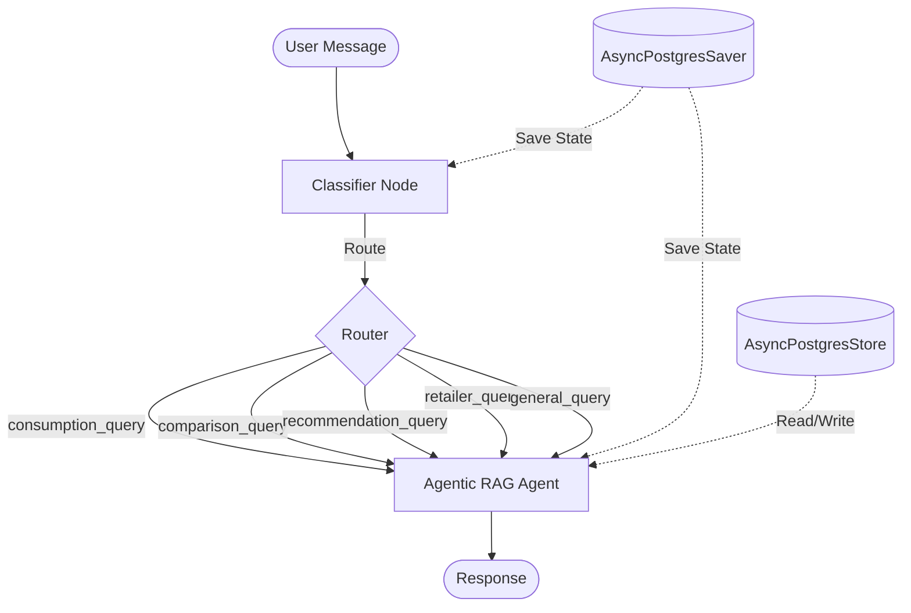

# LangGraph API Reference

Comprehensive guide to invoking and configuring the LangGraph conversational agent.

---

## Table of Contents

1. [Overview](#overview)
2. [Graph Architecture](#graph-architecture)
3. [State Management](#state-management)
4. [Configuration](#configuration)
5. [Invocation Patterns](#invocation-patterns)
6. [Memory & Persistence](#memory--persistence)
7. [Streaming](#streaming)
8. [Error Handling](#error-handling)

---

## Overview

VoltPulse uses **LangGraph** for stateful, multi-turn conversations with persistent memory. The graph architecture provides:

- **Conversational Memory**: Multi-turn context retention via PostgreSQL checkpointing
- **Agent Memory**: Long-term semantic memory storage for personalization
- **Tool Orchestration**: Autonomous tool selection and execution
- **State Management**: Structured conversation state with type safety

**Key Components:**
- **AsyncPostgresSaver**: Conversation checkpoint storage
- **AsyncPostgresStore**: Agent memory for semantic retrieval
- **StateGraph**: Graph-based conversation flow
- **ChatOllama**: LLM integration (GPT-OSS 120B)

---

## Graph Architecture

### Graph Structure

```
START → Classifier → Router → Agentic RAG → END
```

**Flow:**
1. **START**: User message enters graph
2. **Classifier**: Categorizes query intent (5 categories)
3. **Router**: Routes to appropriate agent
4. **Agentic RAG**: ReAct loop with 5 specialized tools
5. **END**: Final response returned

### Node Definitions

```python
# backend/graph/builder.py:90-103

graph_builder = StateGraph(State)
graph_builder.add_node("classifier", create_classifier(llm))
graph_builder.add_node("agentic_rag", agentic_rag_agent)

graph_builder.add_edge(START, "classifier")
graph_builder.add_conditional_edges(
    "classifier",
    router,
    {"agentic_rag": "agentic_rag"}
)
graph_builder.add_edge("agentic_rag", END)

graph = graph_builder.compile(
    checkpointer=checkpointer,
    store=store,
)
```

---

## State Management

### State Schema

```python
# backend/graph/state.py:6-8

class State(TypedDict):
    messages: Annotated[list, add_messages]
    message_type: str | None
```

**Fields:**
- `messages` (list): Conversation history with automatic message merging via `add_messages`
- `message_type` (str | None): Query category from classifier (consumption_query, comparison_query, etc.)

### Message Format

Messages follow LangChain's message schema:

```python
{
    "role": "user" | "assistant" | "system",
    "content": "message text",
    "type": "human" | "ai" | "system"
}
```

**Example State:**
```json
{
  "messages": [
    {
      "role": "user",
      "content": "What's my electricity usage?",
      "type": "human"
    },
    {
      "role": "assistant",
      "content": "Let me check your consumption data...",
      "type": "ai"
    }
  ],
  "message_type": "consumption_query"
}
```

---

## Configuration

### Config Object

Every graph invocation requires a configuration object:

```python
config = {
    "configurable": {
        "thread_id": "user_123_conv_456",
        "user_id": "user_123"
    }
}
```

**Parameters:**
- `thread_id` (string, required): Unique conversation thread identifier
- `user_id` (string, required): User identifier for memory retrieval

### Thread Management

**Thread ID Format:** `{user_id}_{conversation_id}`

**Best Practices:**
- Use consistent `thread_id` for multi-turn conversations
- Create new `thread_id` for new conversation topics
- Store `thread_id` client-side for session continuity

**Example:**
```python
# New conversation
config = {
    "configurable": {
        "thread_id": f"user_{user_id}_conv_{uuid4().hex[:8]}",
        "user_id": user_id
    }
}

# Continue existing conversation
config = {
    "configurable": {
        "thread_id": "user_123_conv_a3f9e2b1",
        "user_id": "user_123"
    }
}
```

---

## Invocation Patterns

### Non-Streaming Invocation

**Method:** `graph.ainvoke()`

```python
# backend/app.py:266-277

response_content = ""
async for chunk in langgraph_chat.astream(
    {"messages": [{"role": "user", "content": request.message}]},
    config,
    stream_mode="values",
):
    if chunk.get("messages"):
        last_msg = chunk["messages"][-1]
        if hasattr(last_msg, 'content') and last_msg.type == 'ai':
            response_content = last_msg.content

return ChatResponse(response=response_content)
```

**Usage:**
```python
result = await graph.ainvoke(
    {"messages": [{"role": "user", "content": "Find me LED lights"}]},
    config
)

final_message = result["messages"][-1].content
```

**Returns:** Complete state dictionary with all messages

---

### Streaming Invocation

**Method:** `graph.astream()`

```python
# backend/app.py:249-258

async def generate_stream():
    async for chunk in langgraph_chat.astream(
        {"messages": [{"role": "user", "content": request.message}]},
        config,
        stream_mode="values",
    ):
        if chunk.get("messages"):
            last_msg = chunk["messages"][-1]
            if hasattr(last_msg, 'content') and last_msg.type == 'ai':
                yield last_msg.content
```

**Stream Modes:**
- `values`: Stream complete state after each node
- `updates`: Stream only state changes per node
- `messages`: Stream individual messages as generated

**Example:**
```python
async for chunk in graph.astream(
    {"messages": [{"role": "user", "content": query}]},
    config,
    stream_mode="values"
):
    # chunk is complete state after each node
    if "messages" in chunk:
        latest_message = chunk["messages"][-1]
        print(latest_message.content)
```

---

## Memory & Persistence

### Conversational Memory (Checkpointing)

**Implementation:** AsyncPostgresSaver

**Features:**
- Automatic state snapshots after each node
- Multi-turn context preservation
- Resume conversations from any checkpoint

**Database Tables:**
- `checkpoints`: State snapshots
- `checkpoint_metadata`: Thread metadata
- `checkpoint_writes`: Incremental state updates

**Setup:**
```python
# backend/graph/builder.py:52-58

checkpointer = AsyncPostgresSaver(pool)
await checkpointer.setup()

graph = graph_builder.compile(checkpointer=checkpointer)
```

**Memory Retrieval:**
Graph automatically loads conversation history based on `thread_id` in config.

---

### Agent Memory (Store)

**Implementation:** AsyncPostgresStore

**Purpose:** Long-term semantic memory for personalization

**Storage Schema:**
```python
await store.aput(
    namespace=("user_memories", user_id),
    key=memory_key,
    value={
        "content": "User prefers 4-tick appliances",
        "timestamp": "2024-06-15T10:30:00Z",
        "relevance_score": 0.95
    }
)
```

**Retrieval:**
```python
memories = await store.asearch(
    namespace=("user_memories", user_id),
    query="appliance preferences",
    limit=5
)
```

**Database Tables:**
- `store`: Key-value memory storage
- `store_index`: Full-text search index

**Setup:**
```python
# backend/graph/builder.py:53-58

store = AsyncPostgresStore(pool)
await store.setup()

graph = graph_builder.compile(store=store)
```

---

### Memory Access in Agents

Agents access memory via `store` parameter:

```python
# backend/agents/agentic_rag.py

memories = await config.get("store").asearch(
    namespace=("user_memories", user_id),
    query=query_text,
    limit=3
)

context = "\n".join([m.value["content"] for m in memories])
```

**Use Cases:**
- Retrieve user's past consumption patterns
- Recall previous recommendations
- Personalize responses based on history

---

## Streaming

### SSE (Server-Sent Events)

**FastAPI Integration:**
```python
# backend/app.py:260-262

return StreamingResponse(
    generate_stream(),
    media_type="text/event-stream"
)
```

**Client-Side (JavaScript):**
```javascript
const eventSource = new EventSource('/chat');

eventSource.onmessage = (event) => {
  console.log(event.data);
  // Append to UI
};

eventSource.onerror = () => {
  eventSource.close();
};
```

### Token-by-Token Streaming

For LLM token streaming (not currently implemented):

```python
async for event in graph.astream_events(
    {"messages": [{"role": "user", "content": query}]},
    config,
    version="v2"
):
    if event["event"] == "on_chat_model_stream":
        token = event["data"]["chunk"].content
        yield token
```

---

## Error Handling

### Common Errors

**1. Missing Configuration**
```python
# Error: Missing thread_id or user_id
config = {"configurable": {}}

# Solution:
config = {
    "configurable": {
        "thread_id": "required_thread_id",
        "user_id": "required_user_id"
    }
}
```

**2. Database Connection Failure**
```python
# Error: PostgreSQL connection timeout
# Check environment variables:
SUPABASE_DB_HOST=db.supabase.co
SUPABASE_DB_PORT=6543
SUPABASE_DB_PASSWORD=<password>
```

**3. State Schema Mismatch**
```python
# Error: Invalid state structure
invalid_state = {"messages": "string"}  # Wrong type

# Solution:
valid_state = {"messages": [{"role": "user", "content": "text"}]}
```

### Retry Logic

```python
from tenacity import retry, stop_after_attempt, wait_exponential

@retry(stop=stop_after_attempt(3), wait=wait_exponential(min=1, max=10))
async def invoke_with_retry(graph, input_state, config):
    return await graph.ainvoke(input_state, config)
```

---

## Advanced Configuration

### Connection Pool Tuning

```python
# backend/graph/builder.py:32-41

pool = AsyncConnectionPool(
    conninfo=create_connection_string(),
    max_size=20,  # Max concurrent connections
    kwargs={
        "autocommit": True,  # No transaction overhead
        "prepare_threshold": None,  # Disable prepared statements
    }
)
```

**Tuning Parameters:**
- `max_size`: Increase for high concurrency (20-50)
- `min_size`: Keep warm connections (default: 10)
- `timeout`: Connection acquisition timeout (default: 30s)

---

### LLM Configuration

**Cloud Ollama (Production):**
```python
# backend/graph/builder.py:62-70

llm = ChatOllama(
    model="gpt-oss:120b",
    base_url="https://ollama.com",
    client_kwargs={
        "headers": {"Authorization": f"Bearer {api_key}"}
    }
)
```

**Local Ollama (Development):**
```python
llm = ChatOllama(
    model="gpt-oss:120b-cloud",
    base_url="http://localhost:11434"
)
```

---

## Graph Visualization

### Mermaid Diagram



---

## API Usage Examples

### Example 1: Simple Query

```python
async def chat(message: str, user_id: str, thread_id: str):
    config = {
        "configurable": {
            "thread_id": thread_id,
            "user_id": user_id
        }
    }

    result = await graph.ainvoke(
        {"messages": [{"role": "user", "content": message}]},
        config
    )

    return result["messages"][-1].content
```

### Example 2: Multi-Turn Conversation

```python
# Turn 1
response1 = await chat(
    message="What's my average consumption?",
    user_id="user_123",
    thread_id="conv_456"
)

# Turn 2 (uses same thread_id)
response2 = await chat(
    message="How does that compare to my neighbors?",
    user_id="user_123",
    thread_id="conv_456"  # Same thread
)
```

### Example 3: Streaming Response

```python
async def stream_chat(message: str, user_id: str, thread_id: str):
    config = {
        "configurable": {
            "thread_id": thread_id,
            "user_id": user_id
        }
    }

    async for chunk in graph.astream(
        {"messages": [{"role": "user", "content": message}]},
        config,
        stream_mode="values"
    ):
        if chunk.get("messages"):
            last_msg = chunk["messages"][-1]
            if last_msg.type == "ai":
                yield last_msg.content
```

---

## Related Documentation

- [Endpoints Reference](./endpoints.md) - `/chat` endpoint usage
- [LangGraph Orchestration](../02-core-systems/langgraph-orchestration.md) - Graph architecture details
- [Agentic RAG System](../02-core-systems/rag-system.md) - Agent implementation
- [Cost Optimization](../02-core-systems/cost-optimization.md) - Memory management strategies

---

**Generated:** 2024-06-15
**LangGraph Version:** 0.2.x
**Implementation:** [backend/graph/builder.py](../../backend/graph/builder.py)
