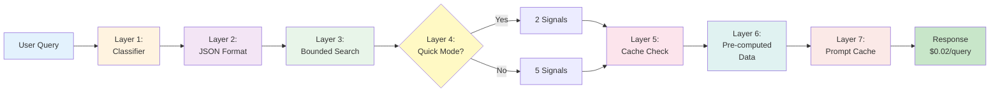
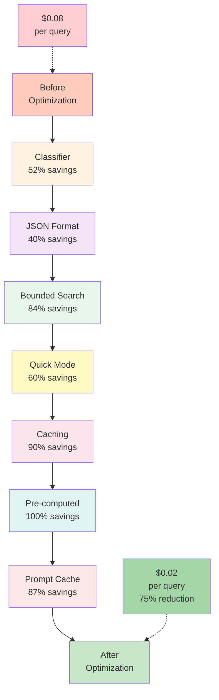
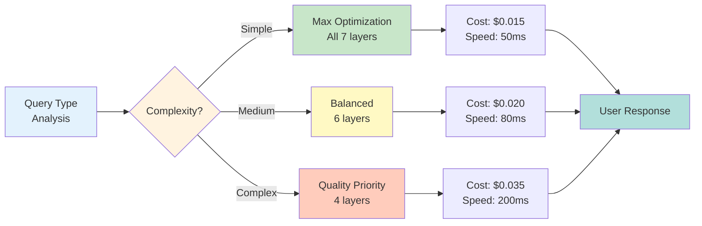
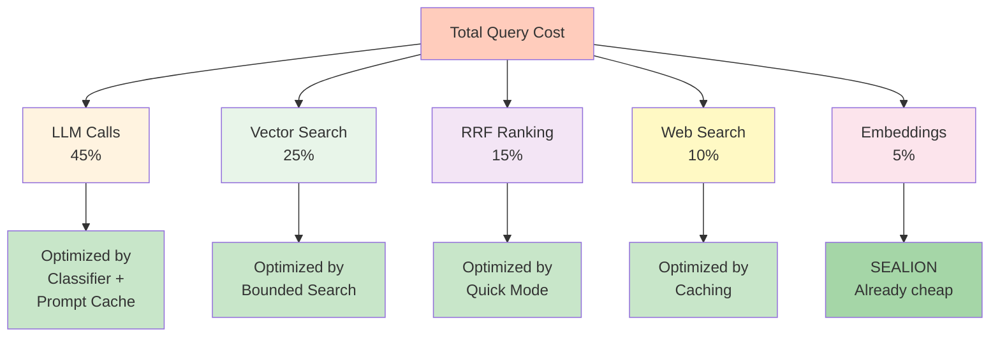

# Cost Effectiveness Flow

## 7-Layer Optimization Pipeline

```mermaid
---
id: 9e4f7c2a-8d1b-4f6e-9a3c-5b8e2d7f1a4c
---
graph LR
    A[User Query] --> B[Layer 1:<br/>Classifier]

    B --> C[Layer 2:<br/>JSON Format]

    C --> D[Layer 3:<br/>Bounded Search]

    D --> E{Layer 4:<br/>Quick Mode?}

    E -->|Yes| F[2 Signals]
    E -->|No| G[5 Signals]

    F --> H[Layer 5:<br/>Cache Check]
    G --> H

    H --> I[Layer 6:<br/>Pre-computed<br/>Data]

    I --> J[Layer 7:<br/>Prompt Cache]

    J --> K[Response<br/>$0.02/query]

    style A fill:#e3f2fd
    style B fill:#fff3e0
    style C fill:#f3e5f5
    style D fill:#e8f5e9
    style E fill:#fff9c4
    style H fill:#fce4ec
    style I fill:#e0f2f1
    style J fill:#fbe9e7
    style K fill:#c8e6c9
```

---

## Cost Reduction Impact

```mermaid
---
id: 6b3f9d2e-4c8a-4f1e-9d7b-2a5f8c1e4d6b
---
graph TB
    A[Before<br/>Optimization] --> B[Classifier<br/>52% savings]
    B --> C[JSON Format<br/>40% savings]
    C --> D[Bounded Search<br/>84% savings]
    D --> E[Quick Mode<br/>60% savings]
    E --> F[Caching<br/>90% savings]
    F --> G[Pre-computed<br/>100% savings]
    G --> H[Prompt Cache<br/>87% savings]

    H --> I[After<br/>Optimization]

    A1["$0.08<br/>per query"] -.-> A
    I1["$0.02<br/>per query<br/>75% reduction"] -.-> I

    style A fill:#ffccbc
    style B fill:#fff3e0
    style C fill:#f3e5f5
    style D fill:#e8f5e9
    style E fill:#fff9c4
    style F fill:#fce4ec
    style G fill:#e0f2f1
    style H fill:#fbe9e7
    style I fill:#c8e6c9
    style A1 fill:#ffcdd2
    style I1 fill:#a5d6a7
```

---

## Optimization Strategy Selection

```mermaid
---
id: 7c2e5f9a-4d8b-4e1f-9c6d-3a7f2b5e8c1d
---
graph LR
    A[Query Type<br/>Analysis] --> B{Complexity?}

    B -->|Simple| C[Max Optimization<br/>All 7 layers]
    B -->|Medium| D[Balanced<br/>6 layers]
    B -->|Complex| E[Quality Priority<br/>4 layers]

    C --> F[Cost: $0.015<br/>Speed: 50ms]
    D --> G[Cost: $0.020<br/>Speed: 80ms]
    E --> H[Cost: $0.035<br/>Speed: 200ms]

    F --> I[User Response]
    G --> I
    H --> I

    style A fill:#e3f2fd
    style B fill:#fff3e0
    style C fill:#c8e6c9
    style D fill:#fff9c4
    style E fill:#ffccbc
    style I fill:#b2dfdb
```

---

## Component Cost Breakdown

```mermaid
graph TB
    A[Total Query Cost] --> B[LLM Calls<br/>45%]
    A --> C[Vector Search<br/>25%]
    A --> D[RRF Ranking<br/>15%]
    A --> E[Web Search<br/>10%]
    A --> F[Embeddings<br/>5%]

    B --> B1[Optimized by<br/>Classifier +<br/>Prompt Cache]
    C --> C1[Optimized by<br/>Bounded Search]
    D --> D1[Optimized by<br/>Quick Mode]
    E --> E1[Optimized by<br/>Caching]
    F --> F1[SEALION<br/>Already cheap]

    style A fill:#ffccbc
    style B fill:#fff3e0
    style C fill:#e8f5e9
    style D fill:#f3e5f5
    style E fill:#fff9c4
    style F fill:#fce4ec
    style B1 fill:#c8e6c9
    style C1 fill:#c8e6c9
    style D1 fill:#c8e6c9
    style E1 fill:#c8e6c9
    style F1 fill:#a5d6a7
```
