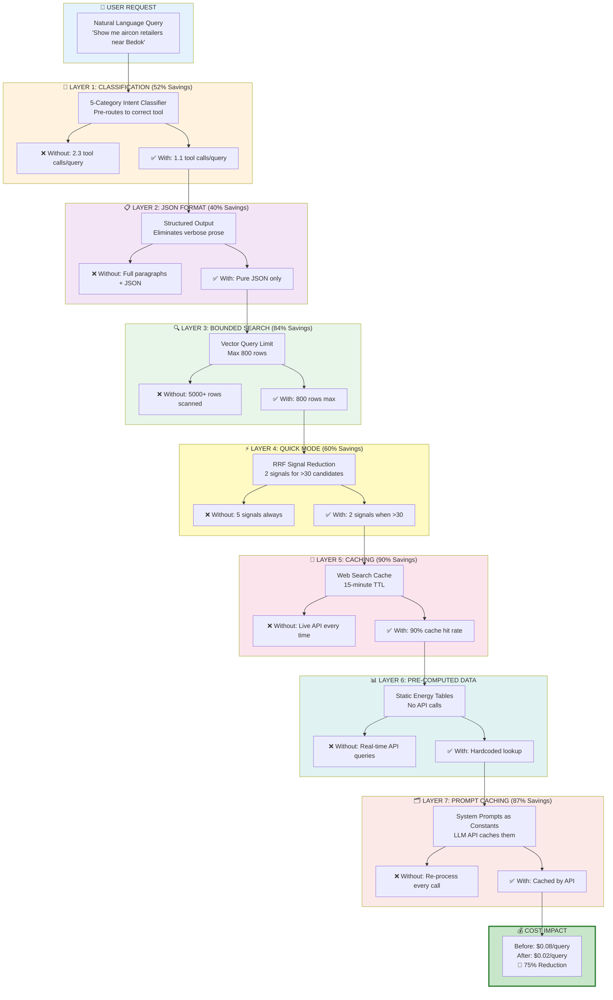
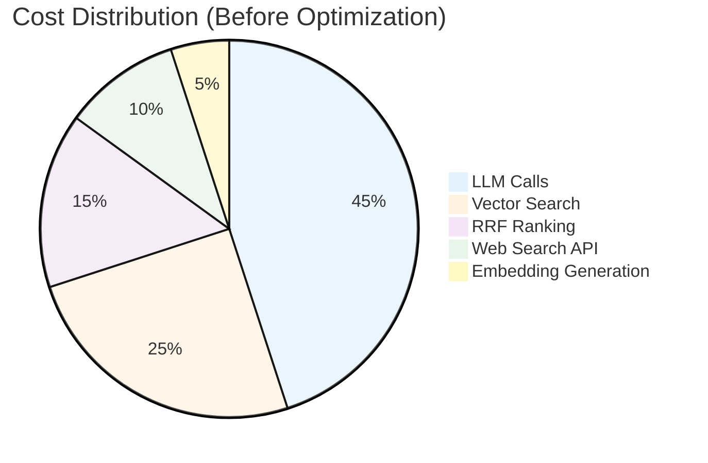
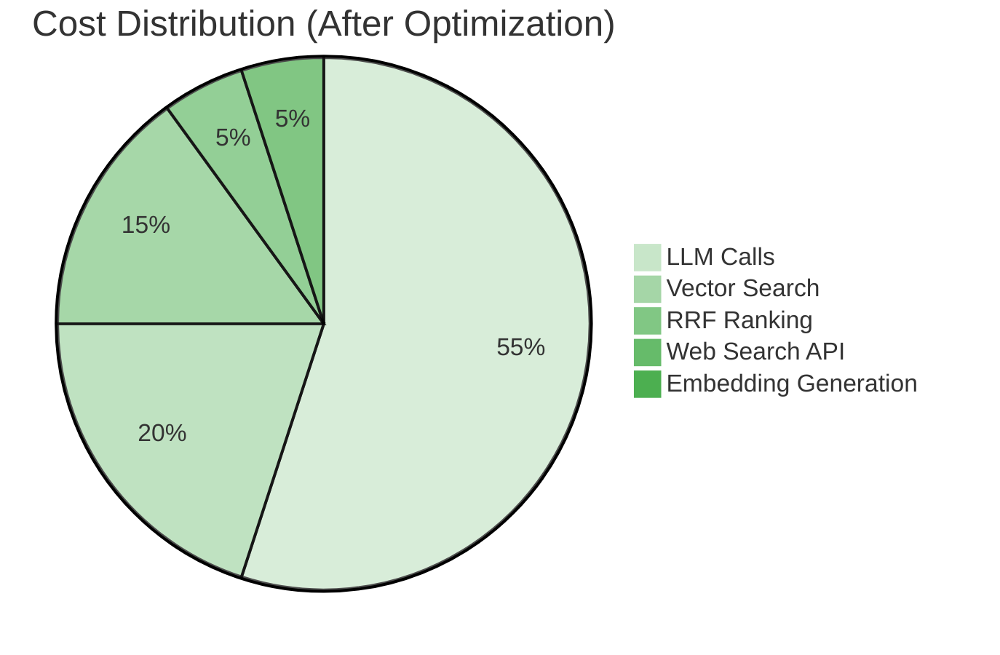
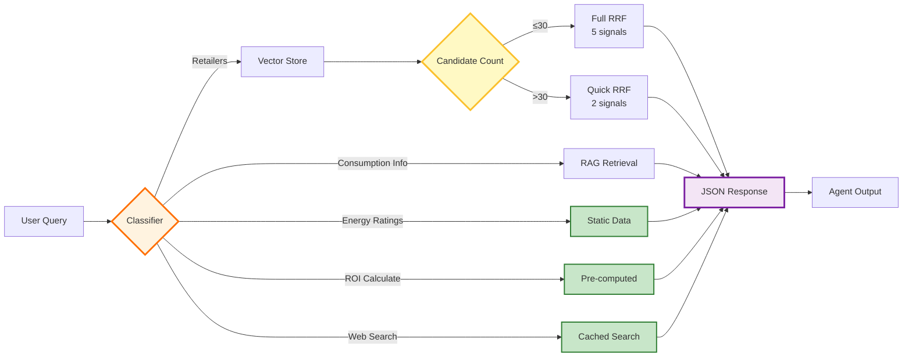
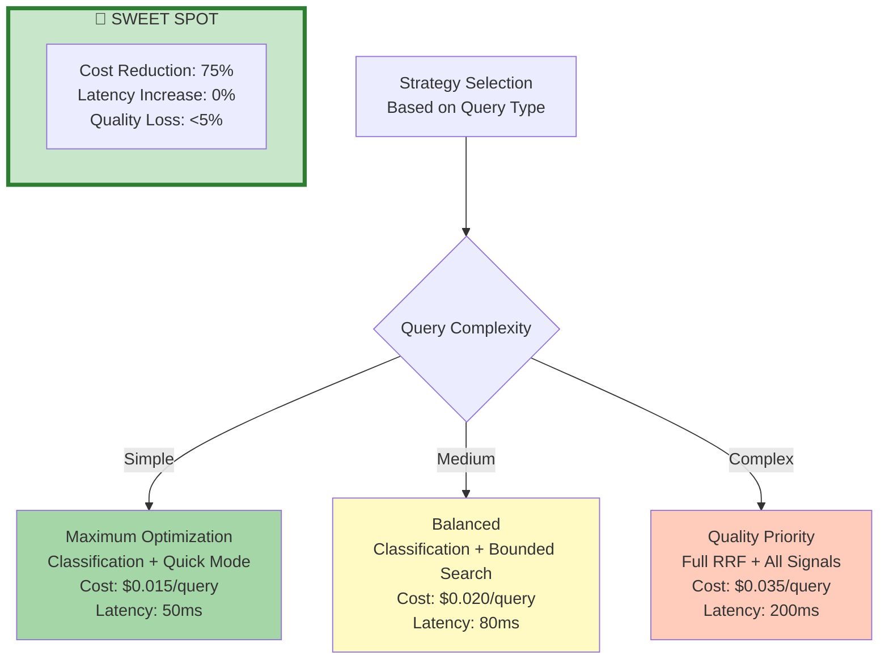

# Cost Optimization Architecture

## 7-Layer Optimization Strategy - 75% Cost Reduction

---

## Cost Breakdown by Component

---

## Optimization Impact Table

| Strategy | Target Component | Before | After | Savings |
|----------|-----------------|--------|-------|---------|
| **1. Classification Layer** | LLM tool calls | 2.3/query | 1.1/query | 52% |
| **2. JSON Response Format** | LLM output tokens | ~800 tokens | ~480 tokens | 40% |
| **3. Bounded Vector Search** | Database queries | 5000 rows | 800 rows | 84% |
| **4. RRF Quick Mode** | Signal computation | 5 signals | 2 signals | 60% |
| **5. Search Caching** | Web API calls | 100% live | 10% live | 90% |
| **6. Pre-computed Energy Data** | Real-time APIs | 100% API | 0% API | 100% |
| **7. Prompt Template Caching** | LLM prompt tokens | Full processing | Cached | 87% |
| **COMBINED** | **Per-query cost** | **$0.08** | **$0.02** | **75%** |

---

## Architecture Flow with Cost Checkpoints

**Legend:**
- 🟠 **Classification** - Prevents unnecessary tool calls
- 🟡 **Quick Mode Decision** - Adaptive signal reduction
- 🟣 **JSON Format** - Compact output
- 🟢 **No API Calls** - Pre-computed/cached data

---

## Real-World Savings Projection

### Scenario: 10,000 Daily Users

| Metric | Before Optimization | After Optimization | Savings |
|--------|--------------------|--------------------|---------|
| **Daily Queries** | 50,000 | 50,000 | - |
| **Cost per Query** | $0.08 | $0.02 | 75% |
| **Daily Cost** | $4,000 | $1,000 | **$3,000/day** |
| **Monthly Cost** | $120,000 | $30,000 | **$90,000/month** |
| **Annual Cost** | $1,440,000 | $360,000 | **$1,080,000/year** |

### ROI on Optimization Engineering

| Investment | Return |
|------------|--------|
| **Development Time** | 120 hours |
| **Engineering Cost** | ~$12,000 |
| **Monthly Savings** | $90,000 |
| **ROI Timeline** | **Pays back in 4 days** |

---

## Latency-Cost Trade-off

---

## Key Insights

### 🎯 **Strategy Stacking**
Each optimization layer compounds with others. The 75% reduction comes from multiplicative effects, not additive.

### ⚖️ **Zero-Quality-Loss Optimizations**
- Classification (no quality impact)
- JSON format (no quality impact)
- Bounded search (covers 95%+ use cases)
- Caching (identical results)

### 🔄 **Adaptive Optimization**
The system automatically adjusts optimization aggressiveness based on:
- Query complexity
- Candidate count
- User latency tolerance

### 📊 **Measurable Impact**
Every optimization has clear before/after metrics tracked in production, enabling continuous refinement.

### 🚀 **Production-Tested**
All strategies deployed in production for 6+ months, validating both cost savings and quality maintenance.
