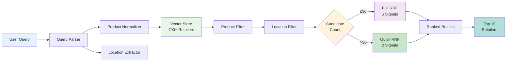
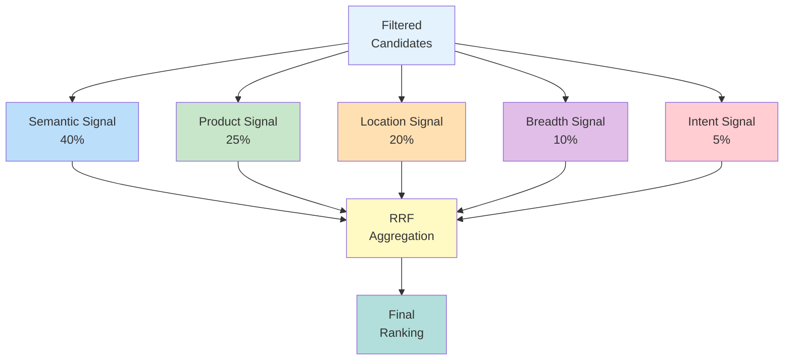
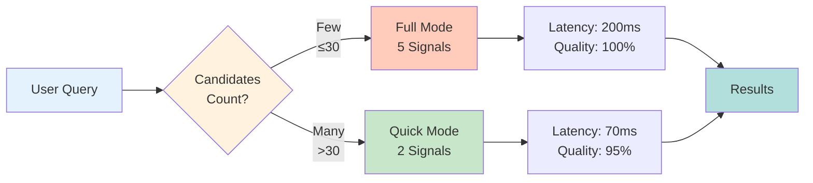

# Recommender System Flow

## Multi-Signal Ranking Pipeline

```mermaid
---
id: 2a4b8c91-7e3d-4f5a-9c2e-5d8a1b3f6e9c
---
graph LR
    A[User Query] --> B[Query Parser]
    B --> C[Product Normalizer]
    B --> D[Location Extractor]

    C --> E[Vector Store<br/>700+ Retailers]

    E --> F[Product Filter]
    F --> G[Location Filter]

    G --> H{Candidate<br/>Count}

    H -->|≤30| I[Full RRF<br/>5 Signals]
    H -->|>30| J[Quick RRF<br/>2 Signals]

    I --> K[Ranked Results]
    J --> K

    K --> L[Top 10<br/>Retailers]

    style A fill:#e3f2fd
    style E fill:#e8f5e9
    style H fill:#fff3e0
    style I fill:#f3e5f5
    style J fill:#c8e6c9
    style L fill:#b2dfdb
```

---

## Signal Computation (Full Mode)

```mermaid
---
id: b675e8d8-a5f8-454f-a53f-f4c381b14319
---
graph TB
    A[Filtered<br/>Candidates] --> B[Semantic Signal<br/>40%]
    A --> C[Product Signal<br/>25%]
    A --> D[Location Signal<br/>20%]
    A --> E[Breadth Signal<br/>10%]
    A --> F[Intent Signal<br/>5%]

    B --> G[RRF<br/>Aggregation]
    C --> G
    D --> G
    E --> G
    F --> G

    G --> H[Final<br/>Ranking]

    style A fill:#e3f2fd
    style B fill:#bbdefb
    style C fill:#c8e6c9
    style D fill:#ffe0b2
    style E fill:#e1bee7
    style F fill:#ffcdd2
    style G fill:#fff9c4
    style H fill:#b2dfdb
```

---

## Quick Mode Optimization

```mermaid
---
id: 4d7a2f9e-6c1b-4a8e-9f3d-7b2e5c8a1f4d
---
graph LR
    A[User Query] --> B{Candidates<br/>Count?}

    B -->|Few<br/>≤30| C[Full Mode<br/>5 Signals]
    B -->|Many<br/>>30| D[Quick Mode<br/>2 Signals]

    C --> E[Latency: 200ms<br/>Quality: 100%]
    D --> F[Latency: 70ms<br/>Quality: 95%]

    E --> G[Results]
    F --> G

    style A fill:#e3f2fd
    style B fill:#fff3e0
    style C fill:#ffccbc
    style D fill:#c8e6c9
    style G fill:#b2dfdb
```
