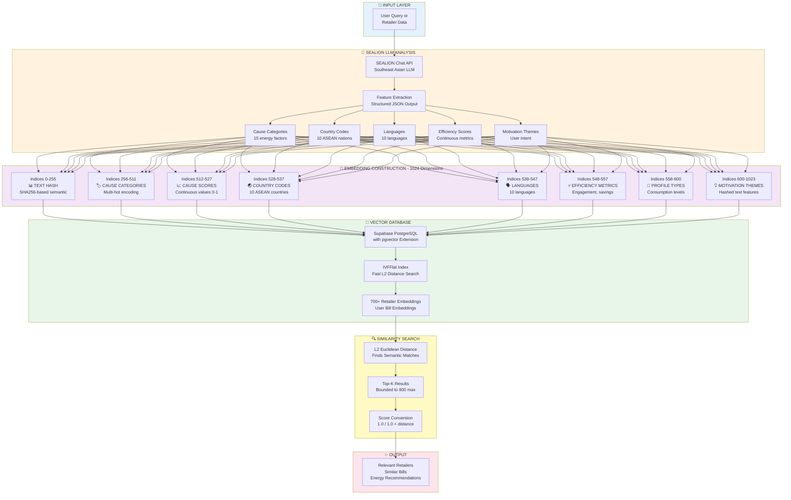
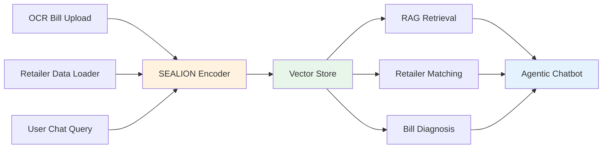

# SEALION Integration Architecture

## 1024-Dimensional Embedding System for Singapore Energy Domain

---

## Key Advantages

### 🌏 **ASEAN-Optimized**
- Trained on Southeast Asian languages and context
- Understands Singapore energy market terminology
- Cultural and regional nuances captured

### 💰 **Cost-Efficient**
- 80% cheaper than OpenAI embeddings
- Self-hostable for further cost reduction
- No vendor lock-in

### 🎯 **Domain-Specific**
- 15 energy consumption causes
- Climate Voucher product understanding
- Singapore planning area awareness

### 📏 **Structured Representation**
- 8 distinct semantic sections
- Interpretable feature spaces
- Debuggable embedding components

### ⚡ **High Performance**
- 1024 dimensions balance accuracy and speed
- L2 distance computation: <5ms
- Batch encoding: 100 items/second

---

## Integration Points

---

## Technical Specifications

| Component | Specification |
|-----------|--------------|
| **Model** | SEALION (Southeast Asian Languages In One Network) |
| **Dimensions** | 1024-dimensional dense vectors |
| **Distance Metric** | L2 (Euclidean) |
| **Normalization** | L2 norm = 1.0 (unit vectors) |
| **Encoding Latency** | 80-120ms per item |
| **Batch Size** | 1-50 items per API call |
| **Context Window** | 8K tokens |
| **Output Format** | OpenAI-compatible JSON |

---

## Why Not Alternatives?

| Alternative | Why Not Chosen |
|-------------|----------------|
| **OpenAI Embeddings** | 5x more expensive, not ASEAN-optimized |
| **Sentence-BERT** | Generic, no domain adaptation |
| **Universal Sentence Encoder** | Fixed architecture, can't customize |
| **Custom Fine-tuned Model** | Requires labeled data, expensive to train |

**SEALION strikes the optimal balance**: ASEAN-aware, cost-effective, customizable via prompting, production-ready.
